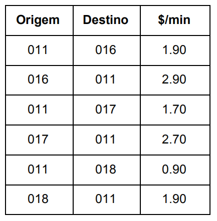
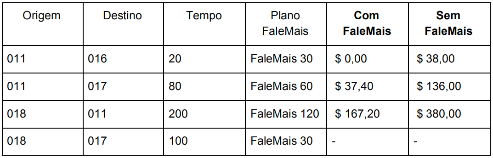

# ShowMeTheCode

## Desafio

A empresa de telefonia Telzir, especializada em chamadas de longa distância nacional, vai colocar um novo produto no mercado chamado FaleMais.

Normalmente um cliente Telzir pode fazer uma chamada de uma cidade para outra pagando uma tarifa fixa por minuto, com o preço sendo pré-definido em uma lista com os códigos DDDs de origem e destino:

Com o novo produto FaleMais da Telzir o cliente adquire um plano e pode falar de graça até um determinado tempo (em minutos) e só paga os minutos excedentes. Os minutos excedentes tem um acréscimo de 10% sobre a tarifa normal do minuto. Os planos são FaleMais 30 (30 minutos), FaleMais 60 (60 minutos) e FaleMais 120 (120 minutos).

A Telzir, preocupada com a transparência junto aos seus clientes, quer disponibilizar uma página na web onde o cliente pode calcular o valor da ligação. Ali, o cliente pode escolher os códigos das cidades de origem e destino, o tempo da ligação em minutos e escolher qual o plano FaleMais. O sistema deve mostrar dois valores: (1) o valor da ligação com o plano e (2) sem o plano. O custo inicial de aquisição do plano deve ser desconsiderado para este problema.

Ex:

## Resolução

O projeto foi feito com o uso do python na versão 3.8.2, o flask no gerenciamento das rotas e sqlite3 como banco de dados.

Para rodar o projeto, foi utilizado o pipenv para gerenciamento das dependências, basta rodar um pipenv install na pasta e todas as dependências serão instaladas. Após a instalação das dependências, no caso do uso do pipenv, basta rodas um 'pipenv shell' na pasta e depois rodas o arquivo app.py que o servidor estará no ar. No caso de não se utilizar o pipenv para instação das dependências, são elas: python 3.8, flask e requests. 

O flask roda no endereço padrão que é o http://127.0.0.1:5000/ e possui apenas duas rotas: '/' e '/resultado'.

Como mencionado, foi utilizado o sqlite3 para teste do banco de dados, não é necessário isntalar o sqlite para rodar o servidor, apenas para rodar o sql diretamente no arquivo do banco de dados(pythonsqlite.db).

Os testes foram feitos usando o unittest e estão denstro da pasta test, eles podem ser executados diretamente do terminal, sem passar pelo flask. Na pasta test, além dos testes de todos os arquivos, ainda contém um diretório chamado 'create_database', onde constam os arquivos utilizados para criar e popular o arquivo do sqlite.

